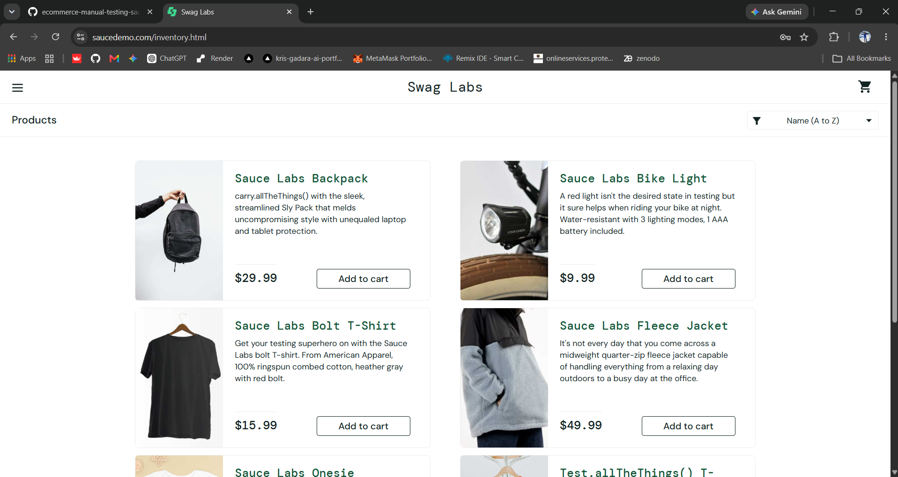
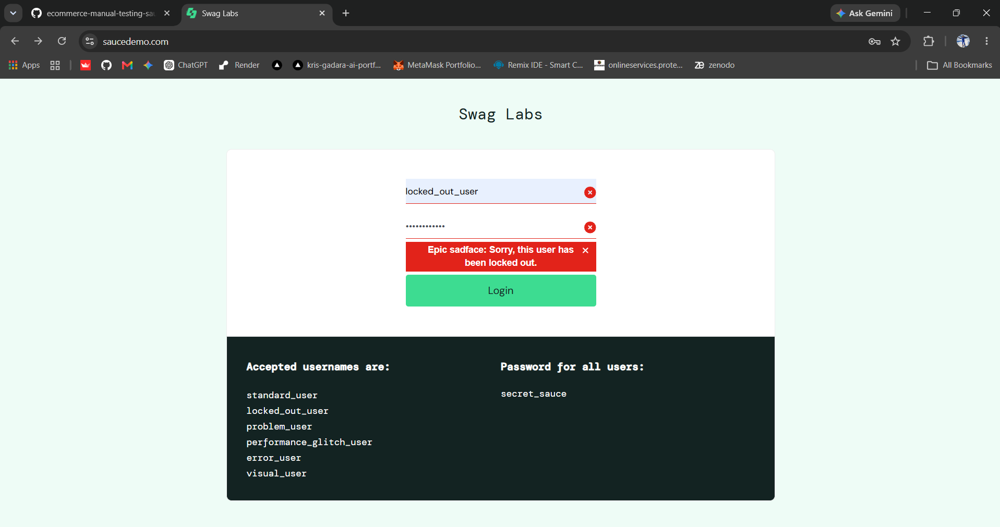
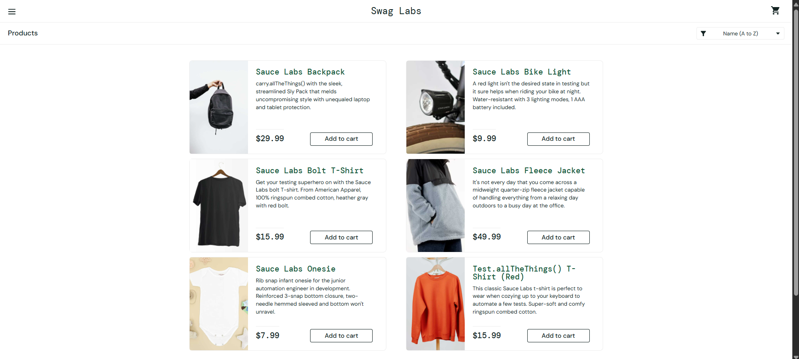
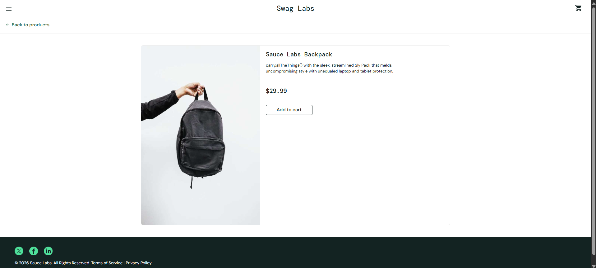
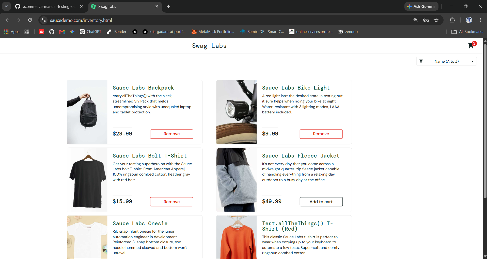
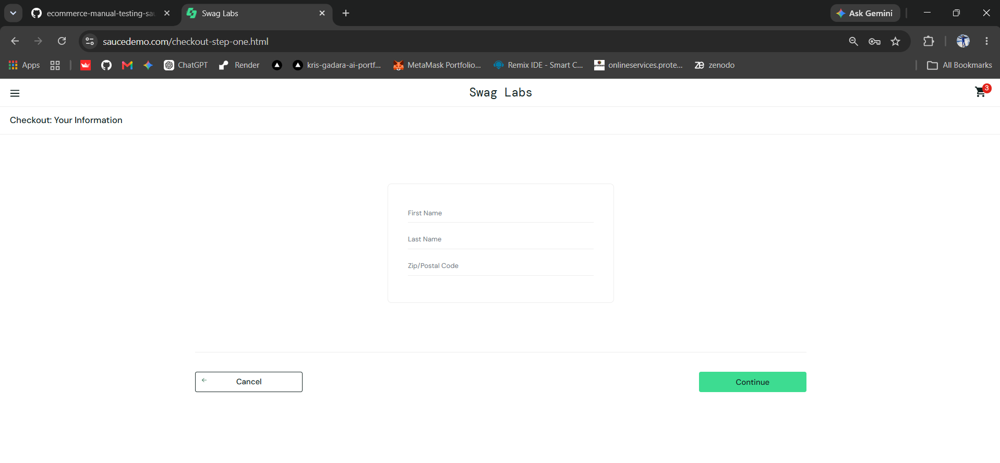
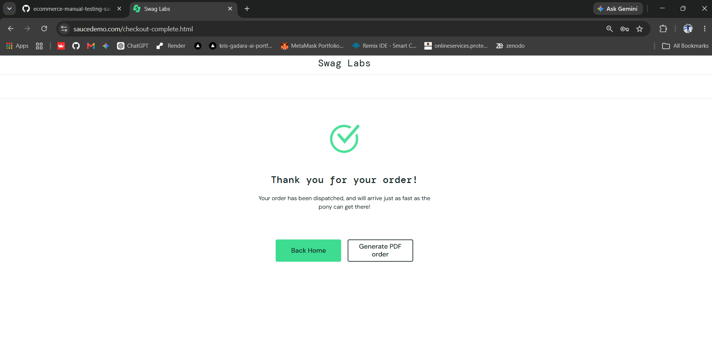
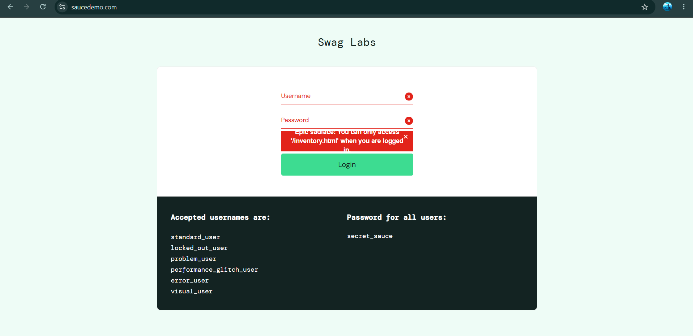

# E-Commerce Website Manual Testing Portfolio Project


A professional, interview-ready manual testing portfolio project built for the **SauceDemo** web application ([https://www.saucedemo.com/](https://www.saucedemo.com/)).

This repository demonstrates industry-standard Quality Assurance (QA) practices, including IEEE-style Test Planning, Scenario Mapping, **39 completed test results**, Defect Reporting, Execution Tracking, and **representative screenshot evidence** from the test cycle.

---

## Test Results Finalized → 8 Representative Screenshots

|                      |                                                                                                                                                                                                   |
| :------------------- | :------------------------------------------------------------------------------------------------------------------------------------------------------------------------------------------------ |
| **Test suite**       | **39 / 39 results finalized: 37 Pass, 2 Fail** (`TC_LOG_001` through `TC_SEC_003`)                                                                                                                |
| **Detailed results** | Per-case status, dates, and notes in [`Test-Execution/TestExecutionReport.csv`](Test-Execution/TestExecutionReport.csv) and [`TestExecutionReport.xlsx`](Test-Execution/TestExecutionReport.xlsx) |
| **Screenshot proof** | **8 sample captures** in [`Screenshots/`](Screenshots/) — portfolio-friendly evidence across login, catalog, cart, checkout, and security (not a count of how many tests were run)                |

Results combine the eight screenshot-backed observations with QA judgments based on the supplied test cases, defect records, and documented SauceDemo behavior. Cases without dedicated evidence are identified as QA judgments in the execution report; this review is not a claim that all 39 cases were freshly re-executed.

---

## 📌 Application Under Test (AUT)

- **Application Name**: SauceDemo (Swag Labs)
- **URL**: [https://www.saucedemo.com/](https://www.saucedemo.com/)
- **Description**: A simulated e-commerce web application featuring authentication, product catalog display, sorting algorithms, cart state management, multi-step checkout workflow, and side menu management.

---

## 📸 Execution Proof Samples (8 Screenshots)

Representative evidence from the test cycle. Each file name maps to a test case ID for traceability.

### Authentication

**`TC_LOG_001`** — Valid login reaches the Products inventory page.



**`TC_LOG_002`** — Locked-out user receives the expected error message.



### Product listing

**`TC_INV_001`** — Inventory page with product grid, prices, and sort control.



**`TC_INV_002`** — Product detail view (Sauce Labs Backpack).



### Shopping cart

**`TC_CRT_002`** — Multiple items added; cart badge and Remove actions on inventory.



### Checkout

**`TC_CHK_001`** — Checkout Step 1: Your Information form.



**`TC_CHK_009`** — Order completion (thank-you page).



### Security

**`TC_SEC_001`** — Direct inventory URL access blocked when not logged in.



| Proof sample        | File                                                |
| :------------------ | :-------------------------------------------------- |
| Valid login         | `Screenshots/TC_LOG_001_Valid_Login.png`            |
| Locked-out user     | `Screenshots/TC_LOG_002_Locked_User.png`            |
| Inventory page      | `Screenshots/TC_INV_001_Inventory_Page.png`         |
| Product details     | `Screenshots/TC_INV_002_Product_Details.png`        |
| Multi-item cart     | `Screenshots/TC_CRT_002_Multiple_Products_Cart.png` |
| Checkout Step 1     | `Screenshots/TC_CHK_001_Checkout_Step1.png`         |
| Order complete      | `Screenshots/TC_CHK_009_Order_Success.png`          |
| Direct URL security | `Screenshots/TC_SEC_001_Direct_URL_Access.png`      |

Sign-off narrative and scope: [`Test-Summary/TestSummaryReport.md`](Test-Summary/TestSummaryReport.md).

---

## 📁 Repository Folder Structure

```text
ecommerce-manual-testing-saucedemo/
│
├── README.md                           # Main Project Documentation & Setup Guide
├── Test-Plan/
│   └── TestPlan.md                     # Comprehensive Test Plan (IEEE standard format)
├── Test-Scenarios/
│   └── TestScenarios.md                # High-Level Scenarios mapped to Test Cases
├── Test-Cases/
│   ├── TestCases.xlsx                  # 39 Detailed Test Cases (Formatted Excel)
│   └── TestCases.csv                   # CSV version for easy GitHub viewing
├── Bug-Reports/
│   ├── BugReport.xlsx                  # Defect Logging Template with Sample Bugs
│   └── BugReport.csv                   # CSV version for easy GitHub viewing
├── Test-Execution/
│   ├── TestExecutionReport.xlsx        # Test Execution Tracking Matrix & Dashboard
│   └── TestExecutionReport.csv         # Per-test execution status and notes
├── Test-Summary/
│   └── TestSummaryReport.md            # Final Test Summary & quality sign-off
├── Test-Data/
│   └── TestData.md                     # Comprehensive Test Data Specifications
└── Screenshots/
    ├── README.md                       # Guidelines for execution screenshots
    ├── TC_LOG_001_Valid_Login.png      # Proof sample (8 files total)
    ├── TC_LOG_002_Locked_User.png
    ├── TC_INV_001_Inventory_Page.png
    ├── TC_INV_002_Product_Details.png
    ├── TC_CRT_002_Multiple_Products_Cart.png
    ├── TC_CHK_001_Checkout_Step1.png
    ├── TC_CHK_009_Order_Success.png
    └── TC_SEC_001_Direct_URL_Access.png
```

---

## 📑 Deliverables Overview

| Artifact                | File Path                                                                            | Purpose                                                                                                                       |
| :---------------------- | :----------------------------------------------------------------------------------- | :---------------------------------------------------------------------------------------------------------------------------- |
| **Test Plan**           | [`Test-Plan/TestPlan.md`](Test-Plan/TestPlan.md)                                     | Defines testing scope, objectives, strategy, environment setup, risk mitigation, and entry/exit criteria.                     |
| **Test Scenarios**      | [`Test-Scenarios/TestScenarios.md`](Test-Scenarios/TestScenarios.md)                 | High-level test conditions covering user journeys and feature modules.                                                        |
| **Test Cases**          | [`Test-Cases/TestCases.xlsx`](Test-Cases/TestCases.xlsx)                             | 39 granular test cases with ID, Title, Preconditions, Steps, Test Data, Expected Result, Actual Result, Status, and Priority. |
| **Bug Reports**         | [`Bug-Reports/BugReport.xlsx`](Bug-Reports/BugReport.xlsx)                           | Production-ready defect template with fields for Severity, Priority, Steps to Reproduce, and Environment.                     |
| **Execution Tracker**   | [`Test-Execution/TestExecutionReport.xlsx`](Test-Execution/TestExecutionReport.xlsx) | Matrix recording the final result, review date, QA reviewer, and observations for all 39 cases.                               |
| **Test Summary Report** | [`Test-Summary/TestSummaryReport.md`](Test-Summary/TestSummaryReport.md)             | QA review summary, final status counts, defect links, and screenshot evidence basis.                                          |
| **Test Data**           | [`Test-Data/TestData.md`](Test-Data/TestData.md)                                     | Documented test data suites (valid/invalid credentials, edge case inputs, postal codes).                                      |

---

## 🎯 Test Coverage Breakup (39 Test Cases)

| Feature Module               |       Test Case Range       | Positive | Negative | Boundary / Edge | UI & Security |
| :--------------------------- | :-------------------------: | :------: | :------: | :-------------: | :-----------: |
| **Authentication & Login**   | `TC_LOG_001` - `TC_LOG_008` |    1     |    5     |        2        |       0       |
| **Product Listing & Detail** | `TC_INV_001` - `TC_INV_003` |    2     |    0     |        0        |       1       |
| **Product Sorting**          | `TC_SRT_001` - `TC_SRT_004` |    4     |    0     |        0        |       0       |
| **Shopping Cart**            | `TC_CRT_001` - `TC_CRT_006` |    6     |    0     |        0        |       0       |
| **Checkout Workflow**        | `TC_CHK_001` - `TC_CHK_011` |    6     |    4     |        0        |       1       |
| **Navigation & App Menu**    | `TC_NAV_001` - `TC_NAV_004` |    3     |    0     |        1        |       0       |
| **Security & Direct Access** | `TC_SEC_001` - `TC_SEC_003` |    0     |    0     |        1        |       2       |
| **TOTAL**                    |      **39 Test Cases**      |  **22**  |  **9**   |      **4**      |     **4**     |

All modules are represented in the completed QA review; see the execution tracker for screenshot-backed versus judgment-based results.

---

## 🚀 How to Review This Project (Portfolio / Interview)

1. **Open Application**: [https://www.saucedemo.com/](https://www.saucedemo.com/) (Chrome or Firefox).
2. **Test design**: Review [`Test-Cases/TestCases.csv`](Test-Cases/TestCases.csv) or the Excel workbook.
3. **Execution record**: Open [`Test-Execution/TestExecutionReport.csv`](Test-Execution/TestExecutionReport.csv) for each test case’s execution status and notes.
4. **Visual proof**: Browse the **8 screenshot samples** in this README and in [`Screenshots/`](Screenshots/).
5. **Summary**: Read [`Test-Summary/TestSummaryReport.md`](Test-Summary/TestSummaryReport.md) for the execution cycle overview.
6. **Defects**: See [`Bug-Reports/BugReport.csv`](Bug-Reports/BugReport.csv) for the defect log template and any logged issues.

---

## 🛠️ Tools & Skills Demonstrated

- **Methodologies**: Software Testing Life Cycle (STLC), Defect Life Cycle, Manual Testing.
- **Test Design Techniques**: Equivalence Partitioning (EP), Boundary Value Analysis (BVA), Error Guessing.
- **Documentation Standards**: IEEE 829 Test Planning Format, Standardized Defect Severity/Priority Matrix.
- **Tools**: Microsoft Excel / CSV Spreadsheets, Markdown, GitHub Version Control.

---

## 💡 Resume Project Highlights for QA Interviews

- "Completed QA review and finalized results for **all 39 SauceDemo test cases** across login, inventory, sorting, cart, checkout, navigation, and security modules."
- "Published **8 screenshot proof samples** in the repository for traceable, interview-ready execution evidence (full results in the Test Execution Report)."
- "Delivered complete STLC artifacts: **Test Plan**, **Test Scenarios**, **Test Cases**, **Execution Tracker**, **Test Summary**, and **Bug Report** templates."

---

_Created by Senior QA Engineer for portfolio verification._
